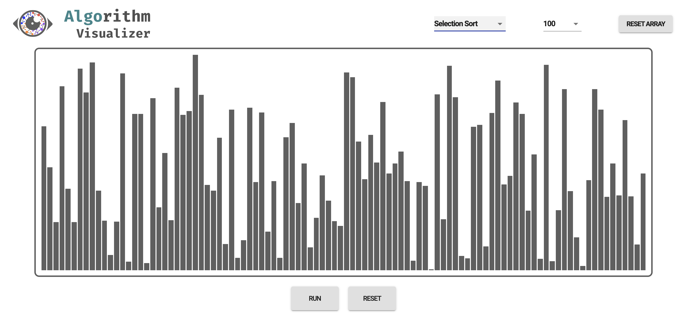

# Algorithm Visualizer

## Overview

Web Application to viusalize the various algorithms.


Currently only sorting algorithms (Selection Sort, Bubble Sort, Insertion Sort, Merge Sort, Quick Sort) are available. Planning to add path-finding algorithms later.

The app is deployed using GitHub Pages and GitHub Actions for CI here: !()[]

### Logo


I designed the logo for fun.

---

## Tech Stack

### Web App

- React with TypeScript
- styled-components and material-ui are used.

### Logo Design

- Figma

---

## Goal

The goal of this web app is to give visual sense of algorithms to help users to choose proper algorithms depending on their situations.

---

## Installation

To run this project locally, run following on the terminal

```
$ git clone https://github.com/sjunhong/algorithm-visualizer.git
$ cd algorithm-visualizer
$ yarn install
```

and run the following to start the react application.

```
$ yarn start
```
